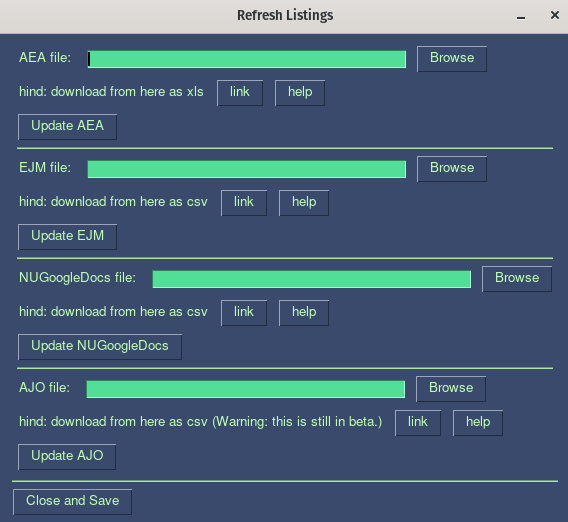
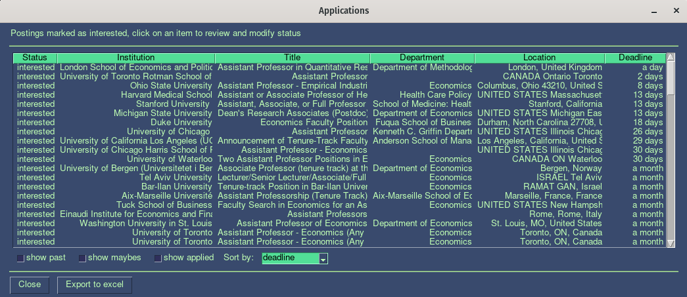

# Job Market Tracker
A simple job application tracker for the Economics Job Market.

## What is it?
This is a small package to manage applications for the job market. It does the following things:
- Manages a list of postings viewed, under consideration, and ignored.
- Allows you to manage deadlines for applications so that you don't miss anything important
- Allows you to manage updates to old postings
- Detects which postings are new and which ones you've already seen

What this currently doesnt do:
- It won't download the posting files for you (or scrape anything)
- It doesn't allow you to filter postings before reviewing one by one (you can do this in the spreadsheets before inputing it to this app)
- For now, it doesn't provide any management of interviewes. I hope to add those later.


## Preview




## Installation
Simply clone/download this git and execute
```sh
python ./main.py
```
a simple GUI should appear.

This codes does have some requirements which you can install with
```sh
pip install -r requirements.txt
```

## Known Issues

If the code crashes on load, a typical issue is the libraries being out-of-date.
Either follow the "install -r" method or run

```sh

pip install --upgrade pandas xlrd PySimpleGui humanize numpy lxml humanize beautifulsoup4 requests

```

## Quick Start

1) Go to "update postings" and download the AEA and EJM files to your local
computer. For the AEA download the native XLS and for the EJM download in CSV.
This system does not provide any type of filtering, so if you want to exclude
rows, you should do so manually in the XLS/CSV files. Once you're ready, set
the location of each file in the finder, and click the update. The system will
review each posting in each file and evaluate whether there are new postings or
updates to existing ones. New postings will be added to your local new-posting
list, while updates will be added to your pending update review list.

2) To manage new postings, go to "Review new postings" This will show each
posting, one by one, allowing you to classify each as interested, maybe
interested, or ignore. You can also see the details of postings or go directly
to the website.

3) To manage updates, go to "Manage updates". The system will list all new
collected updates and will allow you to accept or reject each update for each
posting.

4) To see your application deadline go to "View deadlines" there you will
find all the postings you marked as interested or maybes. Note that many postings
have incorrect deadline in AEA and EJM. Often the correct deadline is in the full text. So
it is recommended that you review each deadline (particularly those that show
up as very far in the future). The system allows you to modify the deadline of
each interested posting manually at this stage.

## Customizing Inputs and Theme

Tired of the retro wave look of the system? checkout custom_settings.py to change the color theme.

Also, the system allows adding custom sources beyond AEA, EJM, and AJO. Sources are added as
dictionaries to the list variables input_option_settings in custom_settings.py. Each source
is a dictionary that must specify a number of mandatory keys, including a url
for the source, the name of the source, and a function to read the
data. See custom_settings.py for further details and examples.

## Help!
Check the help button in the GUI for further instructions on how to use this app.
Any issues, submit them through the issue tracker here on github.

## Contributing
To contribute to this effort please submit a pull request or contact me directly.


